## Overview

In this workshop, we will learn how to setup CI/CD (continuous integration/continuous deployment) with Github actions and Azure! We will start from the ground up from creating a Github repo, creating a .Net MVC project, implement unit tests, pull request templates, tying pull requests to issues, using infrastructure as code (specifically Bicep), and deploying the finished product to Azure! We will also deploy to multiple environments to show the benefit of infrastructure as code and manual approvals to promote releases from environments to environments!

When we finish this workshop you will have a working CI/CD pipeline, that is running automated testing, requesting manual approvals from a dev to prod env, and an API you can hit!

## Prerequisites

There are a few tools we want to make sure we have prior to starting this workshop we want to make sure we have [.Net Core CLI](https://dotnet.microsoft.com/en-us/download/dotnet) make sure you pick the latest LTS version, a code editor like [VS Code](https://code.visualstudio.com), [git cli](https://git-scm.com/downloads), [Azure CLI](https://docs.microsoft.com/en-us/cli/azure/install-azure-cli), and an [Azure Account](https://portal.azure.com).

## Task 1 Create 2 RGs

Now that we have our Azure account setup we are going to do the rest of this lab within the day. You should be able to do this on the free tier of Azure, but to minimize spend we are going to finish this point on in a day. I'll do my best to call out things that cost money, why we are choosing what we are choosing so in the real world you'll be able to alter this walkthrough to fit your needs. We are going to create 2 resource groups to hold our two environments. Typically in practice you will create a resource group per environment and they are like a bucket to hold all of the resources related to that environment. You will then typically tag all resources for the same project with the same tag so you can see what your spend is per project. You can also segment costs by resource group so your higher compute/support production environments can be separated in a cost breakdown from the rest.

The first thing we are going to do is search for the resource group.

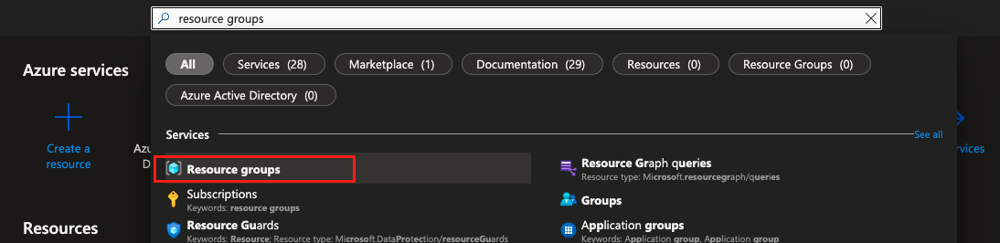

You may ask since we are going to use infrastructure as code why are we manually creating these? There's two main reason Azure doesn't allow you to create resource groups via Bicep or ARM, and when we create a token to publish from Github we are going to scope it to just a particular resource group and not the whole Azure subscription. This is best practice in case it is every compromised they only get access to one resource group not everything. Go ahead and name your resource groups something like resource-group-nonprod and resource-group-prod. Region shouldn't matter, but in practice it's best to pick the one nearest to your main user pool. I'll go with US East since that's the default.

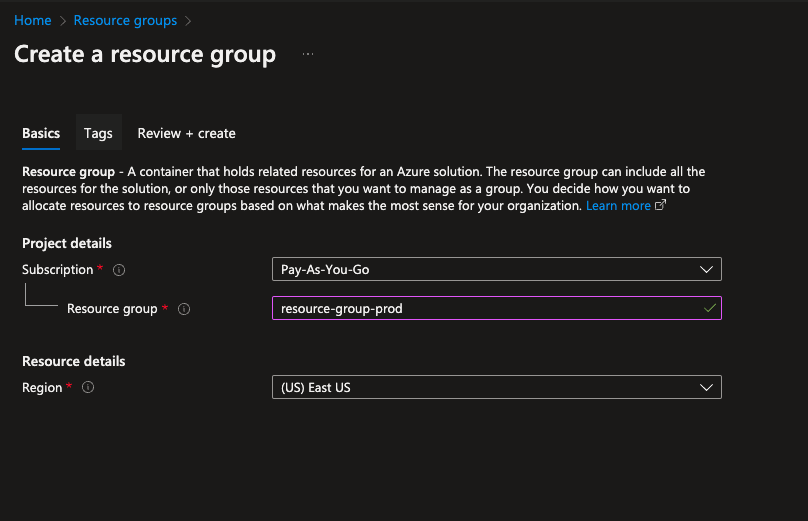

Lastly, I'm going to tag it ACW-Tutorial just so I know the costs of running this versus whatever else might be in my subscription. \*Note Azure bills at a subscription level and you can use tags to help filter down costs. By default they will help filter you down by resource type too, but that's not really scalable past a few resource groups.

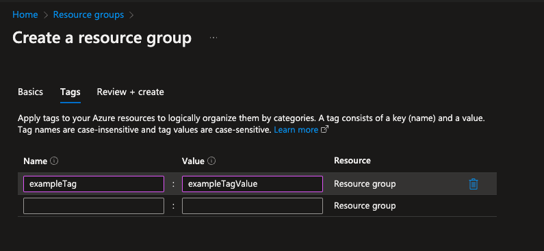

Repeat for other environment!

Now that we have 2 resource groups we need to create the connection between Azure and Github.

## Task 2 Setup Azure Connection

In order to connect GitHub to Azure we are going to use Azure login action with OpenID. We will do this twice once for each resource group to have a separation in connections. In this section we will be using the Azure CLI (Command Line Interface) to setup everything we need to get going. We are going to start with `az login` that command will open a window and authenticate your terminal of choice (probably the one in VS Code) to Azure!

```bash
az login
```

1.  Now to get everything working with open ID we need to create an Azure Active Directory application (this sounds scary but it's a way to identify your app from a security perspective). That will be `az ad app create --display-name <your app name>` \*Note from now on when there's <> that indicates put your value here and remove <>. For example if my app will be foobar I would do

    ```bash
    az ad app create --display-name foobar
    ```

2.  Next we want to create a service principal for that app id. A service principal is typically a non-user object that can interact with things/get permissions like people. We will run `az ad sp create --id <appId>` if you missed your id you can run `az ad app list --display-name <your app name>` to list your app to find your correct app ID. This command is creating a service principal for the app. Next we need to give it roles so it can do something.

    ```bash
    az ad sp create --id <appId>
    ```

3.  To give it roles we want to do `az role assignment create --role contributor --subscription <subscriptionId> --assignee-object-id <assigneeObjectId> --assignee-principal-type ServicePrincipal --scope /subscriptions/$subscriptionId/resourceGroups/<resourceGroupName>` You want to copy the object id from the previous command into assigneeObjectId, get your subscription id by `az account list`

    ```bash
    az role assignment create --role contributor --subscription <subscriptionId> --assignee-object-id <assigneeObjectId> --assignee-principal-type ServicePrincipal --scope /subscriptions/$subscriptionId/resourceGroups/<resourceGroupName>
    ```

4.  Save clientId, subscriptionId, and tenantId to use later in GitHub actions.
5.  Repeat for prod

## Task 3: Init Repo

The first step to create a repository on Github we will need to create a GitHub account! You will need to go to [github.com](https://github.com) and create an account. This is a free account that you account that will be used to store our code. If you are not familiar with Github as a whole feel free to dig a little deeper, but my TLDR explanation is Github is a code source repository acquired by Microsoft and the houser of many Open Source Software Projects! We can use Github for free, and can chose to make our repos public or private. There are also many enterprise options for Github too!

Now that you have an account we can create a Github repository!
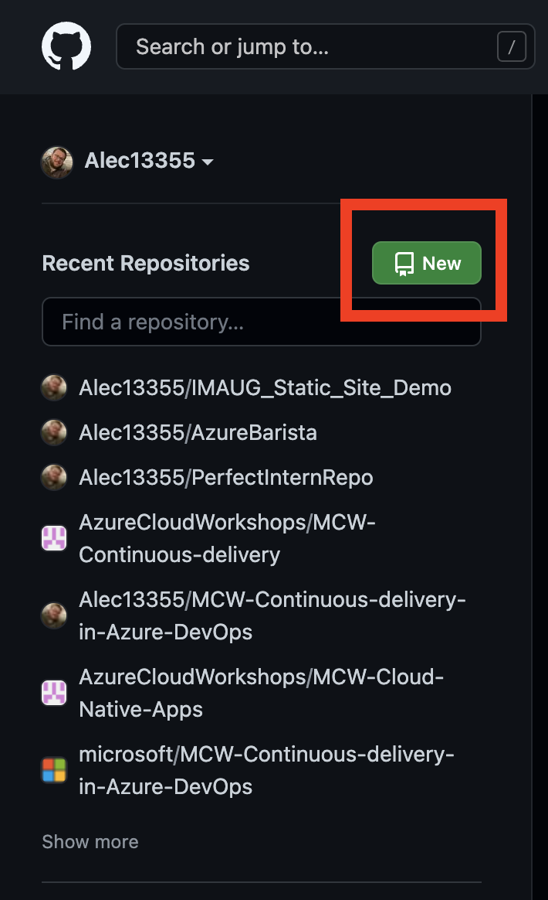
you will want to click on new repository and name it something you can find later! You have two options public (meaning the whole world can see it) or private that unless you add others only you can see it! My recommendation at this point is private, but if you plan to do this as a resume booster or what to share with a friend or colleague pick public.

Now that you have a repository you should have a green code button with a drop down. Click download zip and extract the folder. Then you want to open up VS code with that folder. After that you want to go to Terminal => New Terminal (works on both Mac and PC).

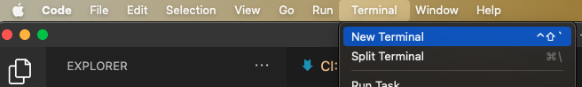

## Task 4 Setup Dotnet

Now if everything is done right we should see a terminal that is similar to here.
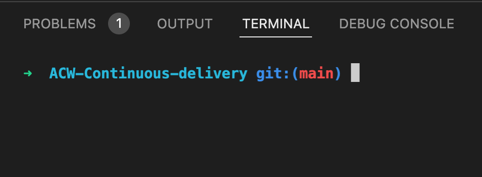

### Task 4.1 Setup Solution

Dotnet projects can have 1 solution but many sub-projects. For example a main api, a test suite, an integration test suite, maybe a third party interaction you at some point will spin off for a nuget package etc. A solution is a way to combine all of these sub-projects into one main folder and build them all at a time. To do this we are going to run `dotnet new sln --name <MySolution>` this will house our testing project and MVC project.

```
dotnet new sln --name <MySolution>
```

### Task 4.2 Create MVC App

Now that we are here our terminal is in an empty directory. What we are going to do is setup a run of the mill Azure MCV app. Nothing fancy, but just something with an endpoint we can hit and see do things. In order to do that in our terminal we are going to run

```
dotnet new webapi
```

That will create a .Net backend sample app. If you want to see what it does run

```
dotnet run
```

\*Note it may ask for you to add something to your keychain on mac this is so you can hit the api and trust the dev cert. Once it starts your terminal should look similar to this
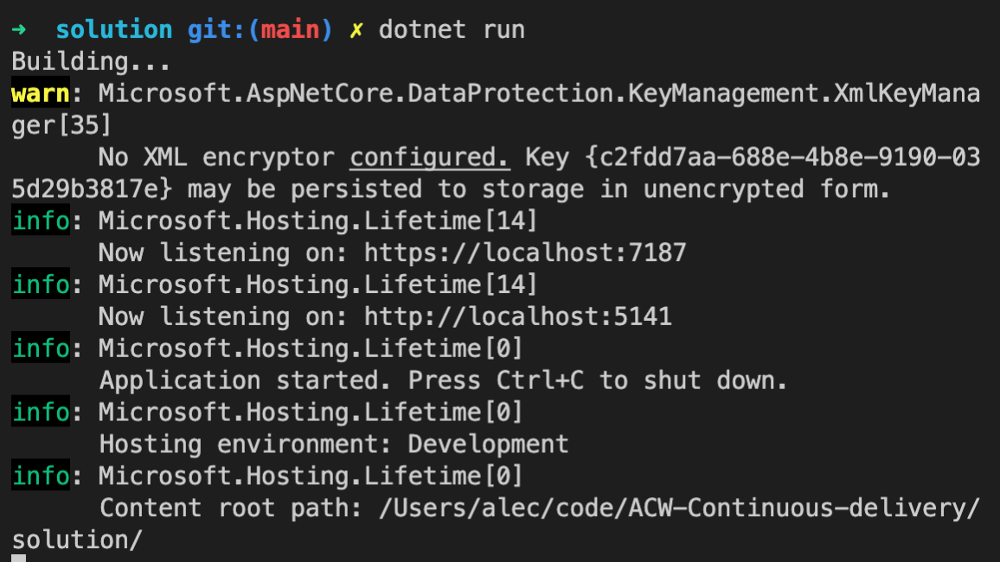
Now that you have the app running you can hit the https url with /WeatherForecast and that will look like this! 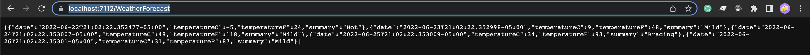 Finally we want to add this project to our solution with this command

```bash
dotnet sln add <path to your new csproj>
```

Steps:

1. `dotnet new webapi`
1. `dotnet run`
1. `dotnet sln add <path to your new csproj>`

## Task 4.3 Setup Testing

We also want to confirm we have a testing project in place because one benefit of CI/CD is running tests on every check in! To create a sub project that is a test project we will run

```bash
dotnet new nunit
```

in a new folder. That by default will create a project with a test that is always passing! We also want to add this to our solution so repeat the dotnet sln add with your new test project too! One final thing in order to unit test methods in our main project we are going to want to reference our main api in our test project with

```bash
dotnet add reference <your api path>.csproj
```

this will allow us to use methods and for our test project to know where things live.

Steps:

1. `dotnet new nunit`
1. `dotnet add reference <your api path>.csproj`

# Task 5 GitHub Final Setup

## Task 5.1 Finalize GitHub and Azure Connection

In order to finalize our GitHub to Azure connection there are a couple of final things we need to do in GitHub. We want to first go to our repos section and create our two environments. You can go there by going to Settings => under code and automation Environments => New Environment we will create pre-prod and prod.

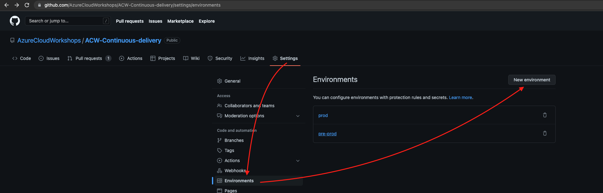

When you create your first one you can see a few options to add as protection for your environments. As a rough general rule of thumb I like to allow all merged code to always go to pre-prod. I also like in green field projects or projects without end users to automatically go to prod too. However, if you have end users or need explicit separation of duties for say like SOCs or SOXs you can add approvers or timers depending on your process. You can also add both so if a required reviewer is being a bottle neck they can be bypassed after a certain amount of time. I like to craft my software development life cycles to specify in SOCs that the developers (after a peer review of code) can manually verify their code works as expected in pre-prod and can trigger the prod release when ready. That helps give everyone a second chance incase something breaks in a deployed environment, unexpected behavior, or just missing AC prior to going to prod. You can also use Feature Flags to get around a lot of these things too.

Now we need to allow GitHub to auth to each of our app registrations.

```bash
az rest --method POST --uri 'https://graph.microsoft.com/beta/applications/<APPLICATION-OBJECT-ID>/federatedIdentityCredentials' --body '{"name":"<CREDENTIAL-NAME>","issuer":"https://token.actions.githubusercontent.com","subject":"repo:organization/repository:environment:Production","description":"Testing","audiences":["api://AzureADTokenExchange"]}'
```

in case you forgot what your object id was you can get that by going to portal.azure.com going to Azure Active Directory => App registrations


and should see your Application (client) ID.
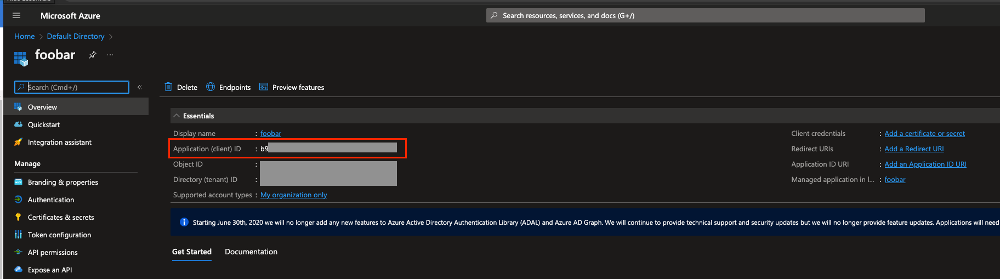
You should get a JSON object {}

Now we need to configure our Azure creds in GitHub. We want to go to GitHub => our repo => Settings => Secrets => Actions => New Repo Secret.
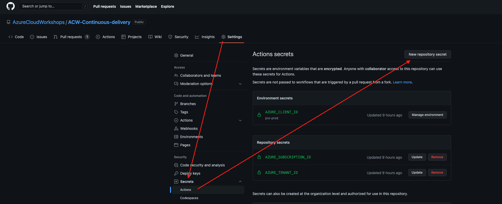

We are going to add our Tenant ID and Subscription ID. We are using this flow because they are the same in both envs we will do something slightly different for Client ID. Now we need to click "Manage your environments and add environment secrets" similar to this.

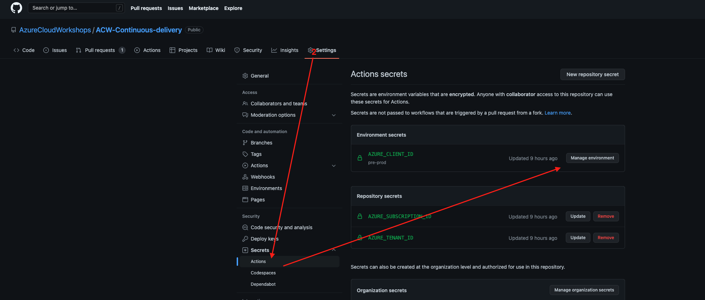
This is because we will have a pre-prod and prod client id. Click into the correct env and select add secret.

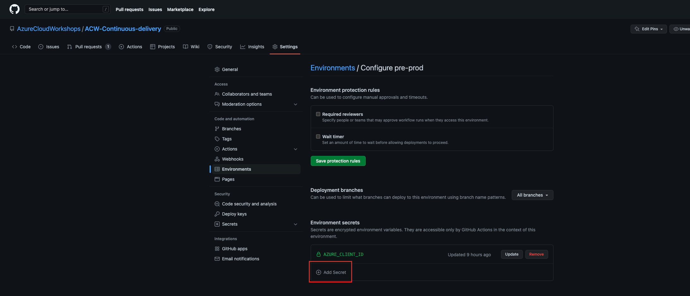
Now we are going to start setting up our pipelines!

## Task 6 Setup test run on PR and main

### Task 6.1 Setup Build Pipeline

Now we need to create a pipeline to run on PR (pull requests) and when we merge code to main. This will run only tests on PRs and run tests and deploy code to Azure on merges of main. To start with you want to create a file named .github/workflows/pipeline.yml this is where GitHub looks for pipelines by default. The first thing we want to do is create a pipeline to run tests and build our dotnet project. This will happen on every push to main and pull_request into main. We are using YML here too so tabs are important. For exact references look at .github/workflows/pipeline.yml for exacts. We want to start with

```YML
on:
  push:
    branches: [ main ]
  pull_request:
    branches: [ main ]

permissions:
  id-token: write
  contents: read
```

This will always run assuming we are pushing to main or doing a pull request into main. These permissions will also be used later on. Next section we want to checkout the repo to be able to access the code.

```YML
jobs:
  build:
    runs-on: ubuntu-latest
    steps:
      - uses: actions/checkout@v2
```

Finally we are going to build and test our dotnet apps

```YML
      - name: Setup .NET Core SDK
        uses: actions/setup-dotnet@v2
      - name: Install dependencies
        run: dotnet restore
      - name: Build
        run: dotnet build --configuration Release --no-restore
      - name: Test
        run: dotnet test --no-restore --verbosity normal
```

Lastly we are going to build our release and publish the feed for later jobs and our infrastructure.bicep file.

```YML
- name: Publish
  run: dotnet publish -c Release -o website
  working-directory: solution

- name: Upload a Build Artifact
  uses: actions/upload-artifact@v2.2.2
  with:
    name: website
    path: solution/website/**
    if-no-files-found: error

- name: Upload a Build Artifact
  uses: actions/upload-artifact@v2.2.2
  with:
    name: iac
    path: solution/infrastructure/infrastructure.bicep
    if-no-files-found: error
```

## Task 7 Infrastructure As Code

Now we want to create our infrastructure as code file. In Azure there are two built in ways to do this ARM Templates (Azure Resource Manager Templates) or newer BICEP. Bicep is much nicer and does compile down to ARM, but it was built with humans in mind so it's much easier to understand for the average person instead of ARM which is JSON and is very verbose. Visual Studio Code does have a Bicep extension that makes life much easier too with linter support!

To begin with since we have different envs and different resource groups we are going to need to pass that in what we want to name everything. I typically like to do something like projectNameResourceType-env for example if we wanted sql server I would usually name it something like foobarSqlServer-nonprod so when I search for foobarSqlServer I get all of my sql servers tied to my current project.

To begin our .bicep file we want to create a infrastructure.bicep file. The first 2 lines we want to add are as follows

```bicep
param env string = 'nonprod'
param location string = resourceGroup().location
```

The first line will hold our parameter for env that can be overridden. However, it has a default value of what it's assigned to. The next line will hold our location. As stated above it's best practice to put your location closest to your users. So typically if you do that with your resource group you can just reference it's location when setting all of the rest (note sometimes new resources or certain resources only have limited region rollout if you're using those you will have to specify a different region).

Now we want to get into creating our cloud server. If you already are running an api on prem you might want to look into running it on an Azure VM, however since this is a greenfield project (new development) we're going to leverage the cloud and save some money using an app service. In order to have an app service you need an app service plan. An app service plan I like to think of as the main computer you are using. It's where you specify the compute power and that directly reflects in your price. For this example we are going to use F1 which is free for 60 minutes of compute. For us occasionally hitting our site that'll be fine. If not we can always up it and pay for more compute. You can see the breakdown of different tiers here.
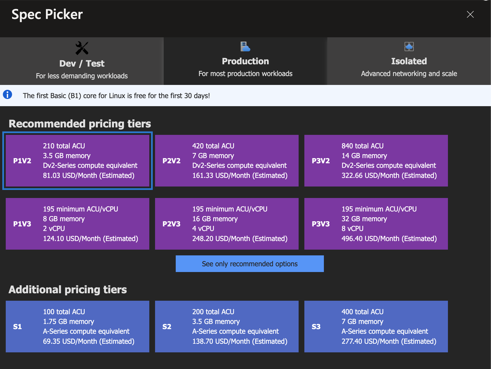
Next is the line we need for our bicep.

```bicep
resource appServicePlan 'Microsoft.Web/serverfarms@2021-03-01' = {
  name: 'resourceGroup().name + "appServicePlan-" + env'
  location: location
  sku: {
    name: 'F1'
  }
  kind: 'linux'
}
```

For this one we specify it is a resource not a var or param (variable or parameter), give it a user readable name, and the type of resource. The next line is the name. We are using some shorthand to get the resource group name and concat that with appServicePlan- and the env. Following that is the location we are just setting it to our resource groups location. The next section is sku. That's where we tell Azure how much compute we are wanting. For example there's 4 common types F1 B1 for Dev/Testing. P1 and S1 for standard and production work loads (pictured above). You can also have isolated app service plans which is where only your apps are hosted on that box. It's really pricy and if you need it it's there, but for the most part most apps will be in the S1 or P1 tiers. Finally is kind if you care of the OS of your server you can specify one. For the most part it doesn't really matter. Now we are going to specify our app service. It's one of the apps running on that server is how I like to think about it.

```bicep
resource appService 'Microsoft.Web/sites@2021-03-01' = {
  name: 'resourceGroup().name + "appService-" + env'
  location: location
  properties: {
    serverFarmId: appServicePlan.id
  }
}
```

This one is fairly similar. First line is the resource readable name and type of resource. After that is the name and location. Finally we have the serverFarmId (aka the server running our app). Now we should be good to deploy our infrastructure and the code to it!

## Task 8 Deployment

Now is where the fun begins! We are going to start by adding a pre prod step!

```YML
merge_job_prod:
  needs: [build]
  if: (github.ref == 'refs/heads/main') && needs.build.result == 'success'
  runs-on: ubuntu-latest
  environment: pre-prod
  steps:
```

This job is named merge_job_prod and it needs the build job. This allows us to use if statements on it. For example we are saying if this is the main branch and if the build step is successful do this step. We also are specifying our pre prod environment.

```YML
- name: Download a Build Artifact
  uses: actions/download-artifact@v2.0.8
  with:
    name: website
    path: website

- name: Download a Build Artifact
  uses: actions/download-artifact@v2.0.8
  with:
    name: iac
    path: iac
```

The next steps will be downloading the artifacts we previously published!

```YML
- name: "Az CLI login"
  uses: azure/login@v1
  with:
    client-id: ${{ secrets.AZURE_CLIENT_ID }}
    tenant-id: ${{ secrets.AZURE_TENANT_ID }}
    subscription-id: ${{ secrets.AZURE_SUBSCRIPTION_ID }}
```

Now we are going to test out our login with the login step. If you run into errors be sure to checkout your app registration
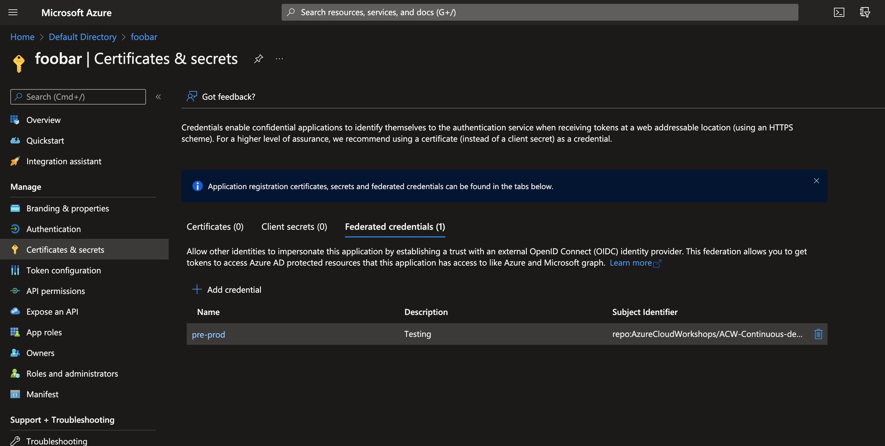
and then under certificates and secrets you should see a federated section that looks similar to this
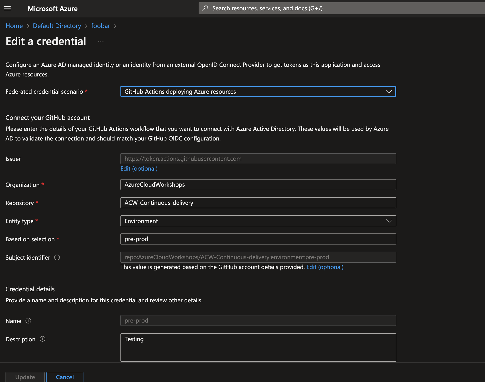
confirm you have everything matching the error log Github gives you if you do run into issues.

Now we are going to deploy our infrastructure!

```YML
- name: Run Bicep deploy
  id: deploy
  uses: azure/arm-deploy@v1
  with:
    subscriptionId: ${{ secrets.AZURE_SUBSCRIPTION }}
    resourceGroupName: resource-group-nonprod
    template: iac/infrastructure.bicep
    parameters: env='nonprod'
```

This is using our same subscriptionId and we are feeding it our resource group, template that we downloaded above, and overwriting our env param. Assuming all of that works as it should your nonprod resource group should have resources created like this.
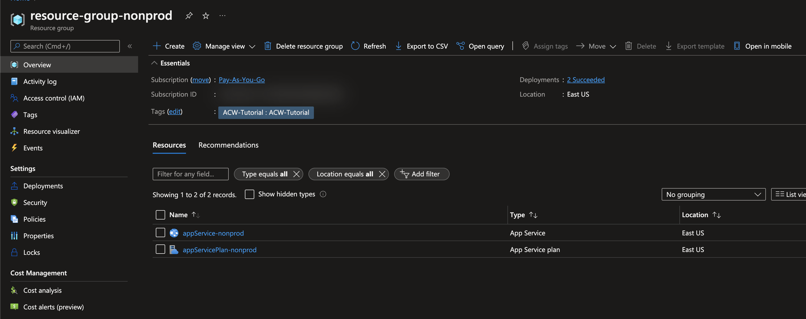
and you should see your app service.
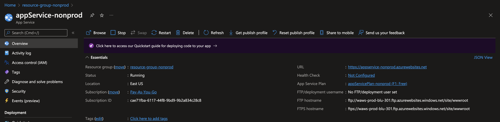
if you click the link before you run the full pipeline you won't see anything there, but you will see the free https domain Microsoft gives you!

Finally we are going to deploy the code to the app service!

```YML
- name: Deploy web app
  id: deploywebapp
  uses: azure/webapps-deploy@v2
  with:
    app-name: appService-nonprod
    package: website
```

Assuming everything works you should get a response similar to this on your own domain!
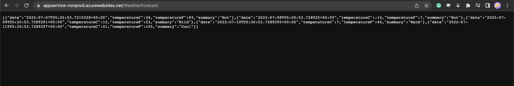

This is using the app name of our resource group and the artifact we packaged and downloaded above! So assuming you have the whole job done it should look something like this!

```YML
merge_job_pre_prod:
    needs: [build]
    if: (github.ref == 'refs/heads/main') && needs.build.result == 'success'
    runs-on: ubuntu-latest
    environment: pre-prod
    steps:
      - name: Download a Build Artifact
        uses: actions/download-artifact@v2.0.8
        with:
          name: website
          path: website

      - name: Download a Build Artifact
        uses: actions/download-artifact@v2.0.8
        with:
          name: iac
          path: iac

      - name: "Az CLI login"
        uses: azure/login@v1
        with:
          client-id: ${{ secrets.AZURE_CLIENT_ID }}
          tenant-id: ${{ secrets.AZURE_TENANT_ID }}
          subscription-id: ${{ secrets.AZURE_SUBSCRIPTION_ID }}

      - name: Run Bicep deploy
        id: deploy
        uses: azure/arm-deploy@v1
        with:
          subscriptionId: ${{ secrets.AZURE_SUBSCRIPTION }}
          resourceGroupName: resource-group-nonprod
          template: iac/infrastructure.bicep
          parameters: env='nonprod'

      - name: Deploy web app
        id: deploywebapp
        uses: azure/webapps-deploy@v2
        with:
          app-name: appService-nonprod
          package: website
```

With that you are now able to have full CI/CD to a dev environment!

## Task 9 Finish this by writing your own deployment to your production environment (feel free to check your solution against the one under solution/infrastructure)

## Task 10 Delete All Of Your Resource Groups

## Task 11 ⭐⭐You have now completed the first part and are officially no longer a novice! Lets keep working on challenges to become dangerous!⭐⭐
