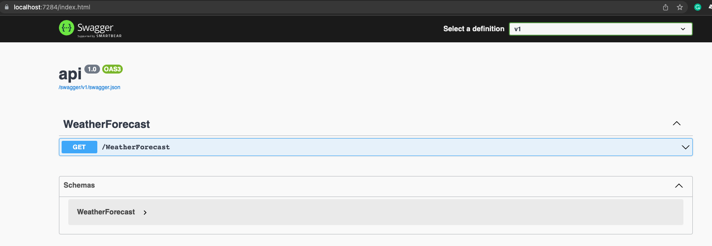

## Overview

This challenge had a few separate use cases I have heard in the real world some of which directly work together and some are just requests for the sake of requests. To refresh our requests were as follows

1. Better utilize compute costs (Don't pay for more than use)
1. Using newer technologies to help attract talent and grow expertise without over committing
1. Implement a monitoring solution to know when the app does crash
1. Implement a solution for displaying endpoint documentation

There are a few different paths for this like right sizing app services, spinning them down outside of peak hours, external monitoring tools like datadog, and having a wiki. However, the solution I picked for sake of this argument is using Swagger code gen for documentation (I picked this because in the future an end user can consume your swagger docs to create middleware services, test your api with in browser UI, and a few other things that we'll talk about in later challenges), for newer technologies we are going to dockerize our API using Docker Desktop deployed to an Azure container app, and we will use app insights to setup email alerts whenever our API is having issues. Here's a picture of the overall infra we are talking about.


## Open API/Swagger Docs

This is such a common thing that with a very small tweak you can get this up and running in your api in no time. One clarification I didn't give is do we want this in development or always? Depending on that answer we can switch where it is located at. Because I am planning on using this in the future to build on in our deployed environment I'm going to have this available in both deployed and development environments. Once you move this code block and snippet you should be able to run the api and it will open up the swagger doc.

```cs
if (app.Environment.IsDevelopment())

app.UseSwagger();
app.UseSwaggerUI(options =>
{
    options.SwaggerEndpoint("/swagger/v1/swagger.json", "v1");
    options.RoutePrefix = string.Empty;
});
```

This is what the swagger doc should look like and you can now test your api endpoints in browser!



## Implementing App Insight Alerts

Now what we are going to do is implement a controller that throws a 500 error. This will be used for us to test exceptions and alerts later on. To start with that we are going to make an error controller in our api project. The typically naming convention is usual <Thing>Controller.cs so we will make ErrorController.cs the content of this file should look like this

```cs
using Microsoft.AspNetCore.Mvc;

namespace api.Controllers;

[ApiController]
[Route("[controller]")]
public class ErrorController : ControllerBase
{
    public ErrorController()
    {
    }
    // Throws an exception to test the error handling in app insights.
    [HttpGet(Name = "ThrowException")]
    public void Get()
    {
        throw new Exception();
    }
}
```

This will allow us to throw exceptions on demand and have app insights log them. We are also going to need to tell our app to use app insights. That will be in our Program.cs. That addition will look like this

```cs
builder.Services.AddApplicationInsightsTelemetry();
```

in our csproj we need to add

```cs
<ItemGroup>
    <PackageReference Include="Microsoft.ApplicationInsights.AspNetCore" Version="2.16.0" />
</ItemGroup>
```

and finally our app settings needs this section added

```json
{
  "APPINSIGHTS_INSTRUMENTATIONKEY": "Copy connection string from Application Insights Resource Overview",
  "Logging": {
    "LogLevel": {
      "Default": "Warning"
    }
  }
}
```

we will read the application insights connection string in our pipeline so we can dynamically set it per env and not have to worry about committing it to Git. This also helps make our API env agnostic.

#### App Insights Bicep

Now that our app itself is ready for app insights and swagger we are going to need to change our infrastructure to add app insights. We want to add an appInsights component and also update our app settings in our app to look for the connection string like so

```bicep
resource appService 'Microsoft.Web/sites@2021-03-01' = {
  name: 'appService-${env}'
  location: location
  properties: {
    serverFarmId: appServicePlan.id
    siteConfig: {
      appSettings: [
        {
          name: 'APPINSIGHTS_INSTRUMENTATIONKEY'
          value: insights.properties.InstrumentationKey
        }
      ]
    }
  }
}

resource insights 'Microsoft.Insights/components@2020-02-02' = {
  name: 'insights-${env}'
  kind: 'webinsights'
  location: location
  properties: {
    Application_Type: 'Web'
    IngestionMode: 'ApplicationInsights'
  }
}
```

Site config is setting our connection string dynamically so we don't have to worry about it being compromised or changing it per env. The next section is the app insights resource itself it is the normal name, kind is webinsights since our API is a webapp, location is going to be our normal location var, and we have properties of Web and ingestion will be from app insights. Now we just need to redeploy our Bicep template and api and we should see changes.
If everything worked as expected you should see a new resource like this

you can also go to you app service to confirm the connection string is correct.
.
Now we can go to our app insights and we should see both success and errors if we go to our swagger page and hit things!
